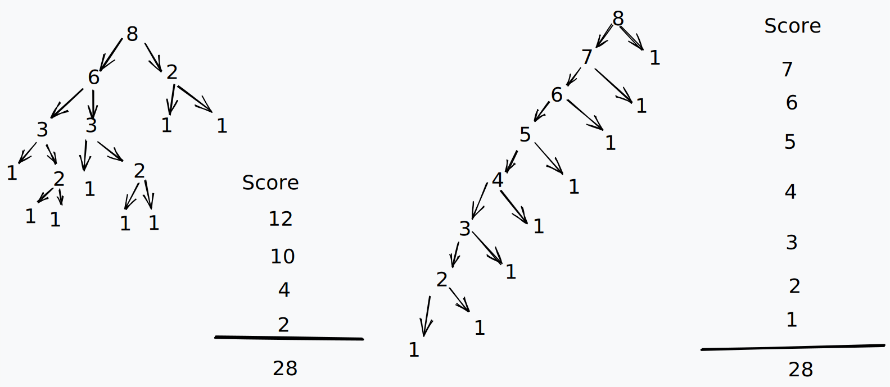

```ad-info
title: Good Proofs
- correct
- complete
- clear
- brief
- elegant (clever, work of art)
- well organized (using lemma)
- inorder (fact -> proof)
```
```ad-warning
title: Proof techniques not to use
- Proof by example
- Proof by omission
- Proof by picture
- Too many notations
```

````ad-question

|     |    |    |     |    |    |    |
| --- | --- | --- | --- | --- | --- | --- |
| A   | B   | C   |     | A   | B   | C   |
| D   | E   | F   |  $\rightarrow$ | D   | E   | F   |
| H   | G   |     |     | G   | H   |     |
```ad-quote
title:
No squence of legal moves to invert G and H and return all other letter to their original position
```

Rules: no diagonal moves

```ad-attention
title: Lemma 1
(Lemma is true statement used in proving propositions)

|     |    |    |     |    |    |    |
| --- | --- | --- | --- | --- | --- | --- |
| A   | B   | C   |     | A   | B   | C   |
| D   | E   | F   | =>  | D   | E   | F   |
| H   | G   |     |     | H   |     | G   |
- A row move does not change the order of the items
```ad-note
title: Proof
In a row move, we move an item from cell `i` into an adjacent `i+1` or `i-1`.
Nothing else moves, hence the order of the items is preserved
```

```ad-attention
title: Lemma 2

|     |    |    |     |    |    |    |
| --- | --- | --- | --- | --- | --- | --- |
| A   | B   | C   |     | A   | B   | C   |
| D   | E   |     |  => | D   | E   | G   |
| F   | H   | G   |     | F   | H   |     |
- A Column move changes the relative order of precisely 2 pairs of items
```ad-note
title: Proof
- In a column move, we move an item in cell `i` to a blank spot in cell `i-3` or `i+3`.
- When a item moves 3 positions, it changes relative order with 2 other items
```

|     |    |    |     |    |    |    |
| --- | --- | --- | --- | --- | --- | --- |
| A   | B   | C   |     | A   | B   | C   |
| F   | D   | G   |  => | D   | E   | F   |
| E   | H   |     |     | G   | H   |     |
- A pair of letter L1 and L2 is an inversion
- (D, F), (E, F), (F, G) inversions.
```ad-warning
title: Lemma 3
During a move, the number of inversions can only increase by 2 or decrease by 2 or stay the same.
```ad-note
title: Proof
- Row move: no changes (by lemma 1)
- Column move: 2 pairs change order (by lemma 2)

Case A: Both paires are inorder $\Rightarrow$ +2 inversions

Case B: Both paires are inverted $\Rightarrow$ -2 inversions

Case C: One pair is inverted $\Rightarrow$ inversion stays the same
```
```ad-abstract
title: Corollary
(corollary is a proposition followed from a lemma)
- During a move the parity (fact of being even/odd) of the number of inversions does not change.
```ad-note
title: Proof
- adding or substracting to does not change the parity.
```
```ad-warning
title: Lemma 4
- In every state reachable from 

	|     |    |   |
	| --- | --- | --- |
	| A   | B   | C   |
	| D   | E   | F   |
	| H   | G   |     |
```
```ad-cite
title: Proposition
P(n): After any sequence of n moves from the start state,
the parity of number of inversion is odd

- Base Case: n = 0 (no moves are made) (start)
- Inductive Step: $\forall$ n $\geq$ 0, Show P(n) $\Rightarrow$ P(n+1)
	Consider any sequence of n + 1 moves $M_1,M_2,M_3,..,M_n$
- Let the parity after moves $M_1,...,M_n$ is odd
- By Corollary 1, we know parity of number of inversions does not change during $M_{n+1}$
- $\therefore$ P(n) $\Rightarrow$ P(n + 1)
```
```ad-info
title: Conclusion
- The parity of the number of inversions in desired state is even.
- By Lemma 4, the desired state cannot be reached from its start state.

|     |    |    |     |    |    |    |
| --- | --- | --- | --- | --- | --- | --- |
| A   | B   | C   |     | A   | B   | C   |
| D   | E   | F   |  $\not\rightarrow$ | D   | E   | F   |
| H   | G   |     |     | G   | H   |     |

```
```

```
````
# Strong Induction Axiom
```ad-important
- Let P(n) be any predicate, If P(0) is true,
   $\forall$ n $\Rightarrow$ P(0) & P(1) & P(2) & ... & P(n) $\Rightarrow$ P(n + 1) is true, then $\forall$ n, P(n) is true.
```
- Here it can be assumed that  P(0) & P(1) & P(2) & ... & P(n) are all true, 
  to prove P(n + 1) is true
````ad-question
All strategies for the n-block game produces the same score S(n).

```ad-note
title: Solution
Proof by Strong induction
- By Inductive Hypothesis, P(n): n blocks in a stack have the same score, i.e. $n(n+1)/2$
- Base Case: P(1) = 0
- Inductive Step: Assume P(1),P(2), ... , P(n) is true, to prove P(n + 
	- $n+1$ is splitted into $k$ and $n+1-k$
	  $$\begin{align*} Score = k(n+1-k)+P(k)+P(n+1-k) \\ 
	  =k(n+1-k)+\frac{k(k-1)}{2}+\frac{(n+1-k)(n-k)}{2} \\
	  =kn-k^2+k+\frac{k^2-k+n^2+n-2kn-k+k^2}{2}\\
	  \Rightarrow Score =\frac{n^2+n}{2}= \frac{n(n+1)}{2}
	  \end{align*}$$
```ad-success
```
```
````